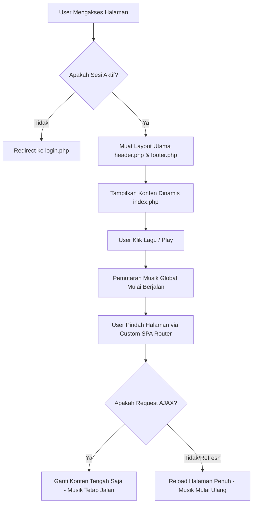
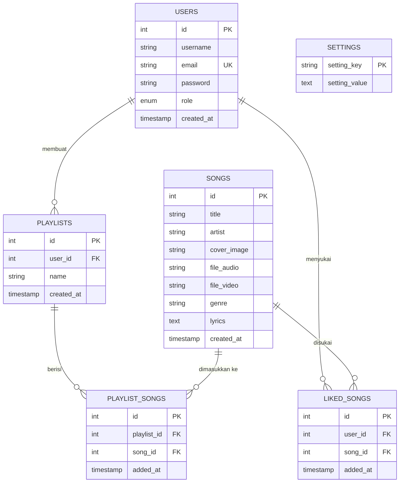

# Panduan Presentasi Aplikasi Web GMusic 🎧

Selamat atas pembuatan web pertamamu! Aplikasi **GMusic** ini memiliki struktur dan arsitektur yang sangat menarik untuk ukuran web pertama, terutama karena menggunakan **Custom SPA (Single Page Application) Router** berbasis AJAX. Fitur ini membuat pemutaran musik tetap berjalan tanpa terputus saat berpindah halaman—sebuah nilai plus yang sangat besar di mata dosen atau penguji!

Dokumen ini disusun untuk membantumu memahami setiap detail teknis dari aplikasi ini agar siap mempresentasikannya dan menjawab pertanyaan penguji dengan percaya diri.

---

## 1. Rangka Dasar & Struktur Modular Web

Aplikasi ini menggunakan pendekatan **Modular (Komponen)** di mana kode antarmuka dipecah menjadi bagian-bagian kecil yang dapat digunakan kembali di berbagai halaman.

### A. Analogi Komponen "Lego"
Setiap halaman web yang diakses pengguna dirakit dari tiga bagian utama:
1. **Kepala & Tangan Kiri (Header + Sidebar Kiri)**: Menggunakan file [header.php](file:///c:/xampp/htdocs/web-programan/header.php). Bagian ini berisi menu navigasi, profil, pencarian, dan daftar playlist yang bersifat statis (selalu sama di setiap halaman).
2. **Badan (Konten Dinamis Tengah)**: Bagian yang berubah-ubah tergantung halaman yang diakses (misalnya [index.php](file:///c:/xampp/htdocs/web-programan/index.php) untuk dashboard, [search.php](file:///c:/xampp/htdocs/web-programan/search.php) untuk pencarian, atau [liked.php](file:///c:/xampp/htdocs/web-programan/liked.php) untuk daftar favorit).
3. **Kaki (Footer + Pemutar Musik)**: Menggunakan file [footer.php](file:///c:/xampp/htdocs/web-programan/footer.php). Bagian ini berisi bar kontrol musik global dan kode pemutar musik berbasis HTML5 `<audio>` serta AJAX SPA Router.

### B. Cara PHP Menggabungkannya
PHP menggabungkan file-file ini secara dinamis saat halaman diakses. Contoh perakitan di dalam beranda utama [index.php](file:///c:/xampp/htdocs/web-programan/index.php):
- Baris pertama: `require 'header.php';` dan `require 'koneksi.php';`
- Baris tengah: HTML tampilan isi halaman dashboard.
- Baris terakhir: `require 'footer.php';`

### C. Folder Utama Proyek
- 📁 **`admin/`**: Panel kontrol khusus admin untuk mengelola lagu dan tema web.
- 📁 **`uploads/`**: Direktori penyimpanan media (audio `.mp3`, gambar cover, dan video `.mp4`).

---

## 2. Alur Sistem & Cara Kerja (Bagaimana Web Berjalan)

Secara umum, web ini bekerja dengan alur sebagai berikut:



### Penjelasan Langkah demi Langkah:
1. **Entry Point (Titik Awal)**: 
   Setiap kali user mengakses situs, sistem akan membaca file `index.php`. Namun, sebelum menampilkan konten utama, script akan memeriksa sesi user menggunakan fungsi `session_start()` di [header.php](file:///c:/xampp/htdocs/web-programan/header.php).
2. **Autentikasi (Keamanan)**:
   Jika tidak ada `$_SESSION['user_id']` (artinya user belum login), sistem akan langsung mengalihkan (*redirect*) ke [login.php](file:///c:/xampp/htdocs/web-programan/login.php) menggunakan perintah `header("Location: login.php")`.
3. **Layouting (Rangka Halaman)**:
   Jika sesi aktif, halaman utama akan dirakit menggunakan teknik pemecahan file:
   - [header.php](file:///c:/xampp/htdocs/web-programan/header.php): Memuat kerangka atas, metadata, Tailwind CSS, Google Fonts, ikon, navigasi sidebar kiri, profil pengguna, dan efek visual tema (seperti doodle, Ramadan, natal, dll.).
   - **Konten Tengah** (seperti [index.php](file:///c:/xampp/htdocs/web-programan/index.php) untuk dashboard, [search.php](file:///c:/xampp/htdocs/web-programan/search.php) untuk pencarian, atau [player.php](file:///c:/xampp/htdocs/web-programan/player.php) untuk lirik detail).
   - [footer.php](file:///c:/xampp/htdocs/web-programan/footer.php): Memuat kerangka bawah, bar pemutar musik global (audio player bar), elemen HTML5 `<audio>`, logika JavaScript pemutar lagu (play, pause, next, prev, volume, lirik), dan **Custom AJAX Router**.

---

## 3. Fitur Kunci: Custom SPA (Single Page Application) Router
> **PENTING!** Ini adalah fitur paling keren di web ini. Penguji kemungkinan besar akan bertanya: *"Bagaimana bisa lagunya tidak mati atau terputus waktu kita ganti halaman?"*

### Cara Kerja SPA Router di GMusic:
Biasanya pada PHP murni, saat kita mengklik tautan `<a>`, browser akan memuat ulang (refresh) seluruh halaman. Hal ini menyebabkan pemutar audio ter-reset dan musik terhenti. 

Di GMusic, kita mengatasi ini dengan trik **AJAX Router** di JavaScript:
1. **Mencegah Reload Bawaan**: Di [footer.php](file:///c:/xampp/htdocs/web-programan/footer.php), terdapat *event listener* global yang memotong klik pada tautan local:
   ```javascript
   document.addEventListener('click', function(e) {
       // ...
       e.preventDefault(); // Menghentikan browser agar tidak reload halaman penuh
       navigateTo(href);    // Menggunakan fungsi fetch custom
   });
   ```
2. **Fetch Konten Saja**: Fungsi `navigateTo(url)` mengirimkan *request* ke server secara latar belakang (AJAX) dengan menambahkan parameter `ajax=1` or header `X-Requested-With: XMLHttpRequest`.
3. **Deteksi di Sisi PHP**: Di bagian paling atas [header.php](file:///c:/xampp/htdocs/web-programan/header.php) dan [footer.php](file:///c:/xampp/htdocs/web-programan/footer.php), terdapat pemeriksaan:
   ```php
   if (isset($_GET['ajax']) || (isset($_SERVER['HTTP_X_REQUESTED_WITH']) && strtolower($_SERVER['HTTP_X_REQUESTED_WITH']) === 'xmlhttprequest')) {
       return; // Jika AJAX, jangan cetak tag HTML luar, langsung keluar!
   }
   ```
   *Hasilnya*: Server hanya mengirimkan konten bagian tengah saja (tanpa sidebar dan tanpa pemutar audio).
4. **Mengganti DOM & Update URL**: JavaScript menerima HTML konten tengah tersebut, memasukkannya ke dalam kontainer utama (`main`), menjalankan tag `<script>` yang ada di dalamnya, dan memperbarui URL di address bar menggunakan `history.pushState()` agar tombol Back/Forward browser tetap berfungsi dengan normal.

Dengan cara ini, **elemen `<audio>` di footer tidak pernah hancur atau ter-reload**, sehingga musik tetap mengalir dengan mulus!

---

## 4. Koneksi & Skema Database (Pemasangan Primary Key)

Koneksi ke database MySQL diatur terpusat di file [koneksi.php](file:///c:/xampp/htdocs/web-programan/koneksi.php) menggunakan pustaka bawaan PHP, yaitu **MySQLi**:
```php
$conn = mysqli_connect("localhost", "root", "", "music_stream");
```

### Struktur Tabel Database (`music_stream`)
Tabel-tabel didefinisikan di file [database.sql](file:///c:/xampp/htdocs/web-programan/database.sql) dan file migrasi:

#### Diagram ERD Visual:


#### Skema Hubungan (Mermaid):


### Konsep Database yang Perlu Kamu Pahami:
1. **Primary Key (PK)**: 
   Kolom unik yang mengidentifikasi setiap baris data di dalam tabel secara unik (tidak boleh ada yang kembar). 
   *Contoh*: Di tabel `users`, kolom `id` dipasang sebagai **PRIMARY KEY** dengan atribut **`AUTO_INCREMENT`**. Artinya, MySQL secara otomatis mengisi nilai `id` mulai dari 1, 2, 3, dan seterusnya saat data baru ditambahkan.
2. **Foreign Key (FK)**:
   Kolom yang menghubungkan satu tabel ke tabel lain. 
   *Contoh*: Di tabel `playlists`, terdapat kolom `user_id` yang merupakan **FOREIGN KEY** merujuk ke `id` di tabel `users`.
3. **ON DELETE CASCADE**:
   Pemasangan relasi foreign key disertai dengan aturan `ON DELETE CASCADE`. Ini sangat penting! Artinya, jika suatu baris data dihapus (misal akun user dihapus), maka seluruh playlist atau lagu yang disukai oleh user tersebut di tabel relasi akan **ikut terhapus secara otomatis oleh database**, mencegah adanya data sampah (*orphan data*).
4. **Unique Key (UK)**:
   Kolom atau kombinasi kolom yang nilainya harus unik.
   - Pada tabel `users`, kolom `email` dipasang `UNIQUE` agar satu email tidak bisa digunakan mendaftar dua akun.
   - Pada tabel `liked_songs`, kombinasi `(user_id, song_id)` dipasang sebagai `UNIQUE KEY` sehingga seorang pengguna tidak bisa menyukai (*like*) lagu yang sama lebih dari satu kali.

---

## 5. Fungsi dari Setiap File

Berikut adalah fungsi dan peran masing-masing file dalam proyekmu:

### A. File Utama di Root
| Nama File | Fungsi / Deskripsi |
| :--- | :--- |
| [index.php](file:///c:/xampp/htdocs/web-programan/index.php) | Halaman Beranda (Dashboard) utama. Menampilkan salam sesuai waktu (Pagi/Siang/Malam), daftar filter genre lagu (seperti Spotify), 6 lagu pilihan acak (*Quick picks*), dan 12 lagu terbaru (*Recently Added*). |
| [koneksi.php](file:///c:/xampp/htdocs/web-programan/koneksi.php) | Mengatur konfigurasi koneksi database MySQL menggunakan `mysqli_connect()`. Dilengkapi kode otomatis untuk membuat tabel dan nilai bawaan `settings` jika belum ada. |
| [header.php](file:///c:/xampp/htdocs/web-programan/header.php) | Membuka sesi user, memuat CSS/JS, sidebar navigasi kiri, daftar playlist pengguna, dan memuat hiasan tema dinamis (Doodle, Ramadan, Natal) di bagian atas layar. |
| [footer.php](file:///c:/xampp/htdocs/web-programan/footer.php) | Memuat pemutar musik global di bagian bawah layar, logika kontrol audio (play/pause/mute/shuffle/repeat/volume), mini video player di sidebar kanan, dan mesin **Custom SPA AJAX Router** (`navigateTo`). |
| [login.php](file:///c:/xampp/htdocs/web-programan/login.php) | Halaman masuk bagi pengguna. Memeriksa username/email dan mencocokkan password menggunakan fungsi enkripsi aman `password_verify()`. |
| [register.php](file:///c:/xampp/htdocs/web-programan/register.php) | Halaman pendaftaran pengguna baru. Mengenkripsi password menggunakan `password_hash()` sebelum disimpan ke database. |
| [logout.php](file:///c:/xampp/htdocs/web-programan/logout.php) | Menghancurkan session pengguna (`session_destroy()`) dan mengalihkan kembali ke halaman login. |
| [player.php](file:///c:/xampp/htdocs/web-programan/player.php) | Halaman detail lagu yang sedang diputar. Memiliki penampil video klip (jika ada video) dan penampil **Lirik Bernyanyi Sinkron (Karaoke Style)** yang otomatis bergulir mengikuti waktu lagu berjalan. |
| [search.php](file:///c:/xampp/htdocs/web-programan/search.php) | Halaman pencarian lagu dinamis berdasarkan judul lagu atau nama artis menggunakan query `LIKE '%keyword%'`. |
| [liked.php](file:///c:/xampp/htdocs/web-programan/liked.php) | Menampilkan daftar lagu-lagu yang telah disukai (*liked*) oleh pengguna saat ini dengan visual gradasi premium. |
| [playlist.php](file:///c:/xampp/htdocs/web-programan/playlist.php) | Menampilkan lagu-lagu di dalam sebuah playlist tertentu. Memungkinkan pengguna memutar seluruh lagu dalam playlist tersebut secara berurutan. |
| [create_playlist.php](file:///c:/xampp/htdocs/web-programan/create_playlist.php) | Memproses pembuatan playlist baru bagi pengguna aktif. |
| [add_to_playlist.php](file:///c:/xampp/htdocs/web-programan/add_to_playlist.php) | Menyediakan form dan memproses penambahan lagu ke dalam salah satu playlist pengguna. |
| [toggle_like.php](file:///c:/xampp/htdocs/web-programan/toggle_like.php) | API internal (endpoint) yang dipanggil lewat JavaScript Fetch untuk menambah/menghapus lagu dari daftar favorit secara *real-time* tanpa memuat ulang halaman. |
| [api_song.php](file:///c:/xampp/htdocs/web-programan/api_song.php) | API internal untuk mengambil detail informasi lagu (termasuk status menyukai dan file video) dalam format JSON berdasarkan parameter ID lagu. |

### B. File Migrasi Database
| Nama File | Fungsi / Deskripsi |
| :--- | :--- |
| [migrate.php](file:///c:/xampp/htdocs/web-programan/migrate.php) | Menambahkan kolom `lyrics` ke tabel `songs` dan membuat tabel `playlists` serta `playlist_songs` jika belum ada di database. |
| [migrate_likes.php](file:///c:/xampp/htdocs/web-programan/migrate_likes.php) | Membuat tabel `liked_songs` untuk mendukung fitur favorit pengguna. |
| [migrate_genre.php](file:///c:/xampp/htdocs/web-programan/migrate_genre.php) | Script migrasi kecil untuk struktur data genre lagu. |

### C. File Admin (Folder `admin/`)
File di dalam folder ini hanya bisa diakses oleh pengguna yang memiliki status `role = 'admin'` di database:
- [admin/index.php](file:///c:/xampp/htdocs/web-programan/admin/index.php): Dashboard panel admin untuk melihat daftar seluruh lagu, mengelola tema aktif situs (Doodle Art, Ramadan, Natal, dll.), serta menyediakan tombol edit/hapus lagu.
- [admin/tambah.php](file:///c:/xampp/htdocs/web-programan/admin/tambah.php): Halaman untuk mengunggah lagu baru (mengisi judul, artis, genre, lirik, file audio .mp3, gambar cover, dan opsional file video .mp4).
- [admin/edit.php](file:///c:/xampp/htdocs/web-programan/admin/edit.php): Halaman untuk mengubah informasi lagu yang sudah ada.
- [admin/hapus.php](file:///c:/xampp/htdocs/web-programan/admin/hapus.php): Memproses penghapusan lagu dari database dan menghapus file fisiknya dari server agar memori penyimpanan tidak penuh.

---

## 6. Kisi-kisi Tanya Jawab (Q&A) Saat Presentasi

Berikut adalah beberapa pertanyaan yang sangat sering diajukan oleh dosen/penguji beserta jawaban taktis yang bisa kamu gunakan:

### Q1: Bagaimana cara web terhubung ke database MySQL?
> **Jawaban:** "Web kami menggunakan koneksi MySQLi secara terpusat melalui file `koneksi.php`. Di dalamnya, kami memanggil fungsi `mysqli_connect()` dengan parameter host (`localhost`), user (`root`), password (`""`), dan nama database (`music_stream`). File `koneksi.php` ini kemudian dipanggil di bagian atas file-file halaman utama menggunakan perintah `require` atau `require_once` PHP."

### Q2: Di mana letak penyimpanan file cover lagu dan file musik yang diunggah?
> **Jawaban:** "Saat Admin mengunggah lagu baru melalui halaman `admin/tambah.php`, file fisik cover, audio, dan video dipindahkan dari direktori sementara server ke folder tujuan di server lokal kami menggunakan fungsi `move_uploaded_file()` di PHP. 
> - Cover disimpan di folder `uploads/covers/`
> - File Audio (.mp3) di folder `uploads/audio/`
> - File Video (.mp4) di folder `uploads/video/`
> Di database, kami hanya menyimpan nama filenya saja (string) untuk efisiensi performa."

### Q3: Bagaimana cara kerja keamanan password pengguna pada sistem registrasi dan login?
> **Jawaban:** "Kami tidak menyimpan password dalam bentuk teks polos (plain text) karena sangat berbahaya. 
> - Saat pengguna melakukan pendaftaran di `register.php`, password dienkripsi secara satu arah (*one-way hashing*) menggunakan fungsi bawaan PHP `password_hash($password, PASSWORD_DEFAULT)` yang menerapkan algoritma **bcrypt** yang sangat kuat.
> - Saat login di `login.php`, kami mengambil data user berdasarkan email/username, kemudian mencocokkan password input dengan hash yang tersimpan di database menggunakan fungsi `password_verify($password, $row['password'])`."

### Q4: Bagaimana cara kerja Sinkronisasi Lirik (Karaoke) pada halaman Player?
> **Jawaban:** "Di halaman `player.php`, kami mengambil teks lirik lagu dari database. Teks lirik tersebut disimpan dalam format penanda waktu standar, yaitu `[menit:detik.milidetik] teks lirik`. 
> 1. JavaScript memecah teks tersebut per baris menggunakan ekspresi reguler (Regex) untuk memisahkan timing dan teksnya, lalu mengubah timing tersebut menjadi format detik (angka decimal).
> 2. Ketika lagu diputar, elemen `<audio>` memicu event `timeupdate` setiap detik.
> 3. JavaScript membandingkan `currentTime` lagu yang sedang berjalan dengan timing tiap baris lirik. Baris lirik yang cocok akan diberi kelas CSS `.active` (tampil bercahaya hijau) dan kontainer lirik akan otomatis digulirkan (*smooth scrolling*) ke tengah layar menggunakan fungsi `scrollTo()`."

### Q5: Bagaimana pembagian hak akses (role) dilakukan?
> **Jawaban:** "Hak akses dikendalikan melalui sesi pengguna (`$_SESSION['role']`). Kolom `role` pada tabel `users` memiliki tipe data `ENUM` dengan nilai `user` atau `admin`.
> - Di setiap halaman admin (folder `admin/`), terdapat pemeriksaan keamanan di baris teratas: jika sesi `role` bukan `admin`, maka sistem akan langsung menolak akses dan mengarahkan kembali ke halaman utama (`index.php`) menggunakan kode `header("Location: ../index.php"); exit();`."

---

*Selamat mempersiapkan presentasi! Semoga sukses dan mendapat nilai terbaik!* 🚀
